# Buildings-Generation

Turn a multi-storey building into one a simulated humanoid can actually walk
through: find its storeys, design and place a staircase that connects them,
bake the result to a voxel cache, and put the whole thing through geometric
acceptance gates that are built to fail.

Works on any building type. A house, a factory, a school and a warehouse differ
in a YAML profile — stair design envelope, storey geometry, thresholds — not in
the code path.

```bash
pip install -e ".[dev]"

buildingsgen types                              # what profiles exist
buildingsgen scan  building.usd --type factory  # what storeys does it have?
buildingsgen run   building.usd --type factory  # connect, bake, accept
```

<p align="center">
  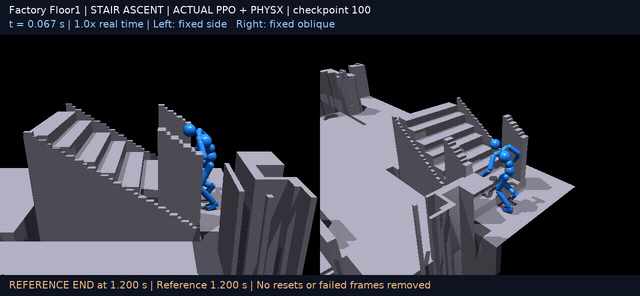
</p>
<p align="center"><em>A humanoid policy climbing a flight this pipeline designed, placed, baked and accepted.<br>
Geometry from this repository; policy trained separately in ProtoMotions&nbsp;/&nbsp;PARC.</em></p>

---

## Why this exists

Generating a building that *looks* right is easy. Generating one a humanoid
policy can be trained in is not, and the failures are invisible in a render:

- A stair whose tread plates are authored with the **underside** on the riser
  grid. The plate thickness leaks into the first step, which becomes
  0.228–0.242 m against a 0.20 m limit. The flight is unclimbable; every
  screenshot looks fine.
- A stair integrated into a building that still authors **one tread per riser**.
  Tread *n* duplicates the upper slab: two walking surfaces a plate-thickness
  apart, right at the arrival.
- A reachability check that applies the body radius only to **seed selection**
  and then floods over un-eroded connectivity. Narrow gaps stay connected and
  buildings look globally traversable. Corrected, the same 50 buildings went
  from 50/50 passing to 0/50.
- A collider set cooked into **convex hulls**. A staircase becomes a ramp, and a
  ramp passes every reachability test for entirely the wrong reason.

Each of those is a check in this repository, each with a negative control that
must fail. The gates are the product; the generator exists to feed them.

---

## Pipeline

```
 source USD ──▶ scan ──▶ connect ──▶ bake ──▶ accept ──▶ evidence JSON
                 │         │           │         │
        storeys from     stair     occupancy   G1..G7,
        geometry, not    design +  + signed    each with
        prim names       placement clearance   a control
```

| Stage | What it does | Entry point |
|---|---|---|
| `scan` | Bakes the source and reports storeys, heights and walkable area. Writes nothing to the source. | `scan_building` |
| `connect` | Designs a flight per storey pair, searches for a pose, **verifies** it by rasterising the stair and re-flooding, then authors it into a root-layer overlay. | `connect_storeys` |
| `bake` | Rasterises every enabled collider into an immutable `.scene_geometry_v1` cache. | `bake_connected` |
| `accept` | Runs the seven gates and writes one evidence record. | `accept_building` |

The source building is **never modified**. Stairs and repairs are authored into
an overlay that sublayers the untouched source, and the source hash is
re-checked after every write.

---

## What the stages produce

|  |  |
|---|---|
| 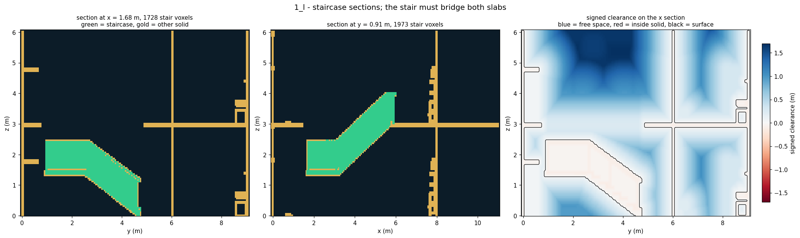 | **`connect`** — the designed flight, rasterised and re-flooded to prove it actually bridges both storeys. A pose is not accepted on geometry alone: the stair is baked into the grid and the walkable set recomputed. |
| 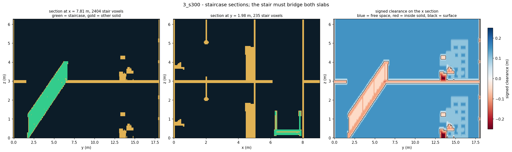 | **`bake`** — occupancy plus the signed-clearance field. Clearance is what makes a 0.25 m × 1.60 m body proxy checkable without a simulator. |
| 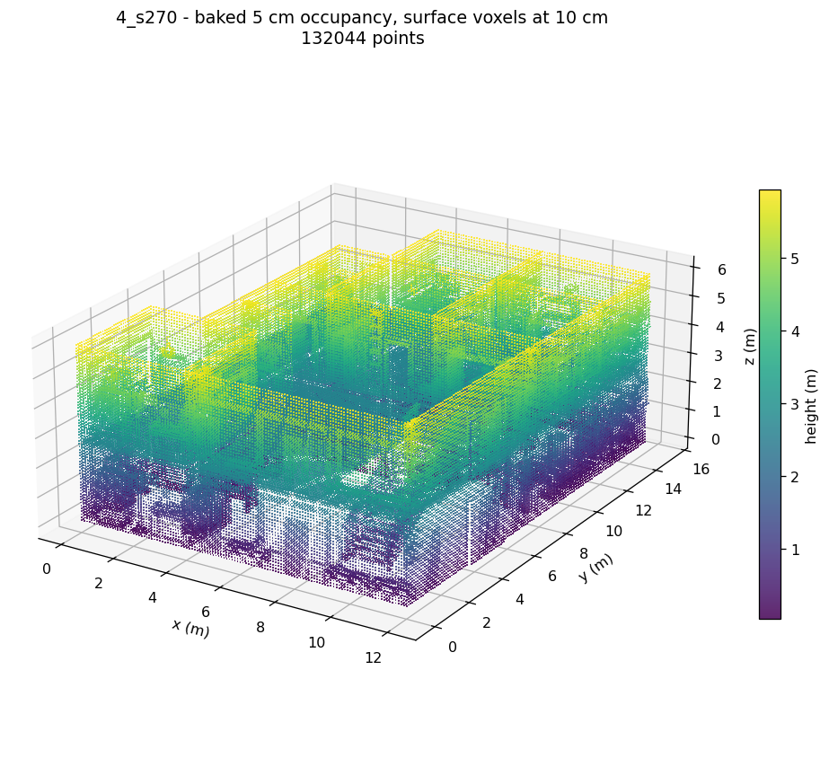 | **`bake`** — a whole building at 5 cm. ~0.5–1.1 M occupied voxels for a two-storey house. |
| 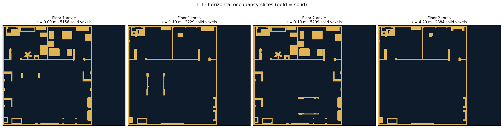 | **`scan`** — horizontal slices. Storeys come from a histogram of walkable heights, not from prim names. |
| 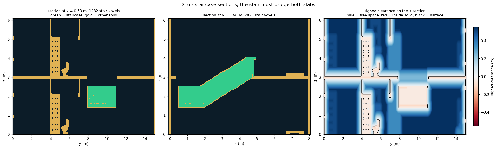 | A U-shaped flight with its mid-flight landing. The family is a profile setting; the placement search and the gates are unchanged. |
| 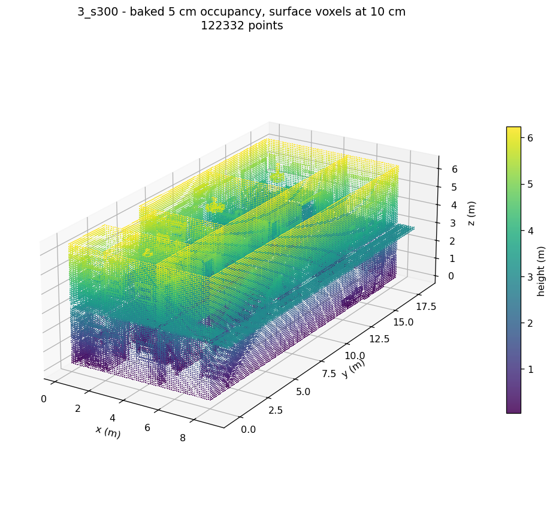 | A double-height space — one of the structures that a 2.5D representation cannot encode at all. |

### Why the cache is 3D, not a height map

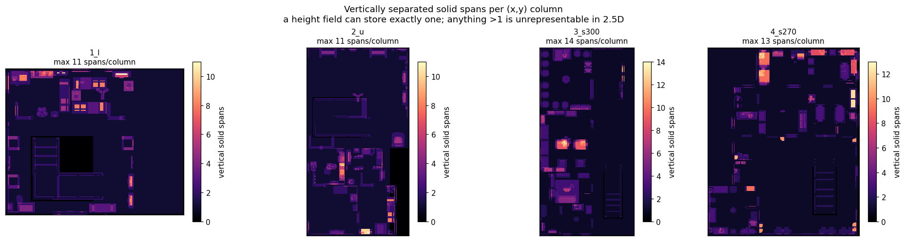

A 2.5D height field stores one surface per `(x, y)` cell. In these buildings
**17–21 % of occupied columns carry two or more vertical solid spans** — a stair
under a landing, a mezzanine over a floor, a double-height void. Those columns
are not *approximated* by a height map; they are unrepresentable in it.

| building | occupied columns | columns with ≥ 2 spans | max spans in one column |
|---|---:|---:|---:|
| `1_l` | 38,313 | 6,551 (17.1 %) | 11 |
| `2_u` | 45,082 | 7,874 (17.5 %) | 11 |
| `3_s300` | 65,668 | 13,651 (20.8 %) | 14 |
| `4_s270` | 72,897 | 12,450 (17.1 %) | 13 |

### A defect that renders do not show

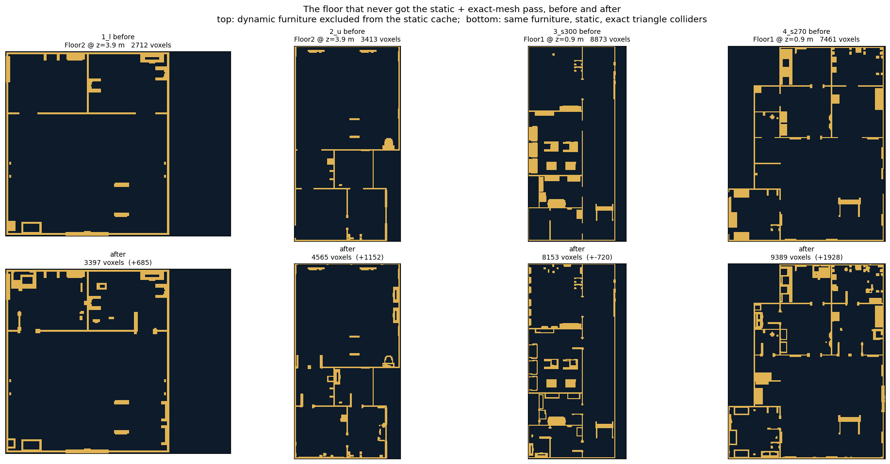

Exactly one floor per building had received the "static + exact triangle mesh +
every instance collidable" pass — and *which* floor varied, while the export
README claimed it for the whole building. On the unpatched floor the furniture
was still dynamic with convex-hull collision, so it was excluded from the static
bake entirely and the floor came out nearly bare. Repairing it through a
root-layer overlay moved occupancy by −0.4 % to +9.1 % and took all four
buildings to 100 % exact colliders, which is what lets the bake be called exact
rather than a preview.

---

## The acceptance gates

| Gate | Question | Negative control |
|---|---|---|
| **G1** structure | Z-up, metre-scale, exact colliders, no dynamic bodies? | relabel one collider `convexHull` → must be rejected |
| **G2** cache integrity | Committed, exact-bake, self-consistent, no NaN? | tamper with the manifest → `load_cache` must raise |
| **G3** USD ↔ voxel | Does the grid agree with the geometry it represents? | displace the samples 0.5 m → recall must collapse |
| **G4** storeys and stair | Two or more plausible storeys, with a flight spanning them and headroom over it? | seal the volume above the flight → coverage must drop |
| **G5** cross-storey route | Can a 0.25 m × 1.60 m body walk from the lower storey to the upper one? | fill the shaft → the upper storey must become unreachable |
| **G6** stair rises | Is **every** rise — first, inner, last — inside the 0.20 m support step? | lower the terrain 0.15 m → the climb must break |
| **G7** body navigation | Is each storey usable from the stair, not merely touched by it? | drop the erosion → it must overstate the walkable area |

A gate has three parts, and a result missing any of them is not an acceptance:
what was measured (numbers with units), what would have failed (a control that
actually ran), and **what the result does not support**. Every gate carries the
last one in its output, because a reader will otherwise supply it themselves.

G6 makes the first and last rise their own measurement on purpose. They are the
two an "average riser" silently skips, and the two that break.

### What a PASS does not mean

Geometric acceptance only: no contact dynamics, no balance, no actuation. A PASS
says the building is not disqualified by its geometry. It does not say a
humanoid policy can traverse it.

### What happened when a policy was trained

The gates stop at geometry on purpose. Separately, humanoid policies were
trained in ProtoMotions / PARC on buildings this pipeline produced — the
empirical half of the claim the gates refuse to make. Click any frame to play.

|  |  |
|---|---|
| [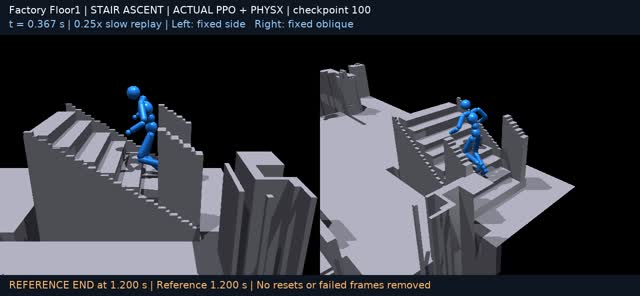](docs/media/videos/stair_ascent.mp4) | **Stair ascent.** The policy climbs a generated flight end to end. This is the motion G5 and G6 are built to predict the *possibility* of, and nothing more. |
| [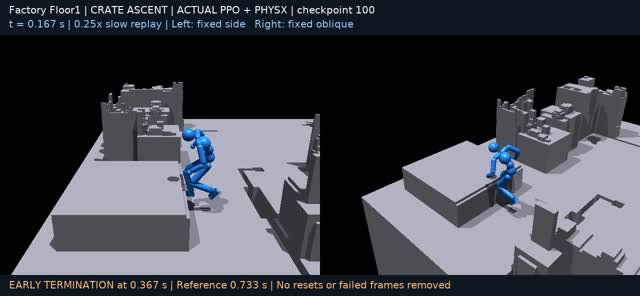](docs/media/videos/crate_ascent.mp4) | **Crate ascent.** Same body proxy, different support geometry — a check that the acceptance envelope is not overfitted to stairs. |
| [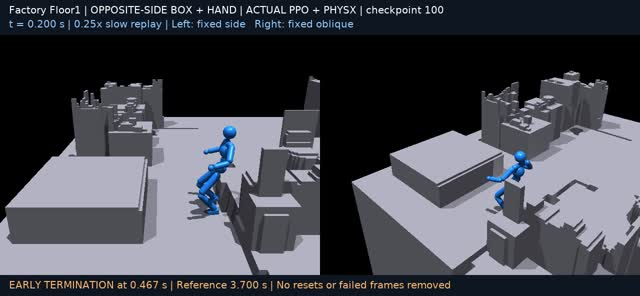](docs/media/videos/crate_traverse_hand.mp4) | **Traverse using the hands.** Contact outside the feet, which no geometric gate in this repository models. |
| [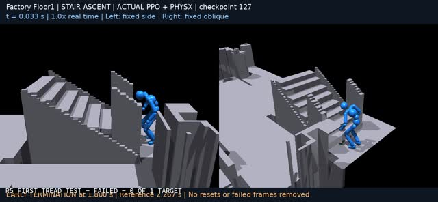](docs/media/videos/stair_first_tread_corrected.mp4) | **The first-tread defect, before and after.** Tread plates authored with the *underside* on the riser grid put 0.228–0.242 m into the first rise against a 0.20 m limit. Two attempts on the same building, one per side of the fix. |

#### Failures, kept on purpose

A policy that only ever appears to succeed has not been shown to be measuring
anything. These two are from the same corpus and are not cherry-picked out.

|  |  |
|---|---|
| [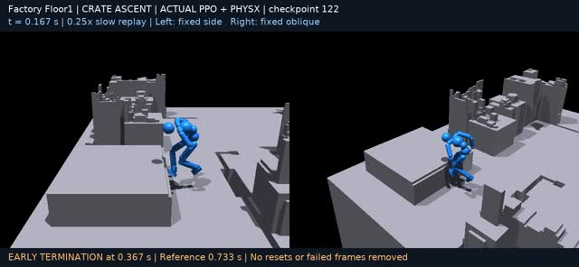](docs/media/videos/failure_crate_ascent.mp4) | **Crate ascent, checkpoint 122.** Fails on a factory floor. |
| [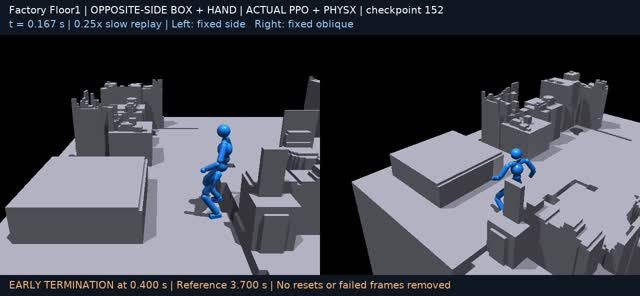](docs/media/videos/failure_traverse.mp4) | **Traverse, checkpoint 152.** Same building, same failure mode. |

Neither building was disqualified by the geometric gates, and both policies
failed on them. That gap is exactly what "a PASS does not say a humanoid policy
can traverse it" means in practice.


---

## Building types

```yaml
# src/buildingsgen/profiles/factory.yaml
name: factory
extends: generic
stair:
  families: [straight, u_shaped]
  preferred_riser_m: 0.185      # steeper industrial flights
  width_m: 1.20
  handrail: double
storeys:
  min_storey_height_m: 3.20     # tall halls, mezzanines
acceptance:
  min_reachable_area_per_storey_m2: 25.0
  max_unreachable_standable_component_m2: 3.0
```

Shipped in `src/buildingsgen/profiles/`: `generic`, `house`, `factory`, `school`,
`warehouse`, `office`. Adding one is a YAML file — see [docs/building-types.md](docs/building-types.md).

Two things a profile may **not** do:

1. **Move the body proxy.** 0.25 m radius, 1.60 m height, 0.20 m support step,
   1.00 m² minimum component, 5 cm voxel. A humanoid is not larger in a
   warehouse. Attempting to override raises `PinnedSemanticsError`.
2. **Loosen a threshold.** A profile may only tighten what `generic` sets; the
   loader rejects the file otherwise. Relaxing a limit has to be an explicit,
   reviewed edit of `generic.yaml`.

Storey detection is geometric — a histogram of walkable heights, not prim names.
A corpus naming its roots `/World/Floor1` and one naming them `/World/Level_00`
give identical results, and there is a test that renames them to prove it.

---

## Install

```bash
pip install -e ".[dev]"        # core + tests
pip install -e ".[figures]"    # + matplotlib for report figures
pip install -e ".[stairs]"     # + Blender/Infinigen for detailed stair assets
```

Core needs only `numpy`, `scipy`, `trimesh`, `usd-core` and `PyYAML`. The
dependency-light stair backend (`buildingsgen.stairs.asset`) is pure OpenUSD and
is what the tests use. Infinigen is optional and gives richer assets through the
same interface — see [docs/provenance.md](docs/provenance.md) for the two
corrections this repository applies to its factories.

---

## Use it

### CLI

```bash
buildingsgen scan  building.usd --type school
buildingsgen stairs --rise 3.4 --type school --out stair.usda
buildingsgen connect building.usd --type school --workspace out/school_a
buildingsgen accept --workspace out/school_a --stair-prim /World/Stair_0
buildingsgen run   building.usd --type factory      # all of the above
```

Every subcommand writes a machine-readable record under the workspace, so a
number can be cited later without rerunning anything.

### Python

```python
from buildingsgen import Workspace, load_profile, run_all

profile = load_profile("factory")
workspace = Workspace(root="out/plant_01", name="plant_01")
record = run_all("corpora/plant_01.usd", workspace, profile)

print(record["acceptance"]["status"])
for result in record["acceptance"]["results"]:
    print(result["gate"], result["status"], result["failures"])
```

Output layout:

```
out/plant_01/
    stages/   plant_01_connected.usda   overlay: stairs only, source untouched
              plant_01_flat.usda        composed stage the gates read
    caches/   plant_01_connected.scene_geometry_v1/
    assets/   plant_01_stair_0/stair.usda + traversal_path.json
    evidence/ scan.json connect.json bake.json acceptance.json
```

---

## Tests

```bash
pytest                  # unit tests, seconds
pytest --runslow        # + end-to-end runs on synthetic buildings, minutes
```

The slow tests build synthetic buildings with **known** defects and assert the
pipeline rejects them: a sealed slab cannot be connected, a 1.2 m ceiling is not
a storey, a 0.30 m slot does not make a storey reachable. A gate that has only
ever seen good input has never been shown to fail.

---

## Layout

```
src/buildingsgen/
    config.py           building-type profiles, inheritance, threshold direction
    pipeline.py         scan / connect / bake / accept, and placement verification
    cli.py              command line
    usd/                stage + overlay rules, colliders, geometric storey detection
    stairs/             design (spec), USD asset, placement search, Infinigen backend
    voxel/              grid, rasteriser, cache format, Standability V1
    acceptance/         gate results, context, the seven gates, runner
    fixtures/           synthetic buildings, with and without defects
    profiles/           generic, house, factory, school, warehouse, office
docs/                   architecture, building-types, acceptance-gates, provenance
```

## Licence and provenance

Apache-2.0. Parts of the voxel and standability code derive from NVIDIA
ProtoMotions (Apache-2.0); the optional stair backend calls Infinigen
(BSD-3-Clause) without vendoring it. See [NOTICE](NOTICE) and
[docs/provenance.md](docs/provenance.md), which lists every derived file and what
changed.
